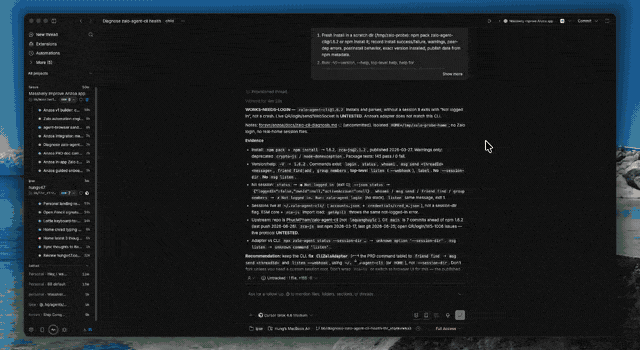

# App Preview

BB plugin that finds the app in the current thread's worktree and starts it in a thread terminal. A setting chooses whether you open the in-app browser yourself, or agents open it when the app is ready. Stop closes that browser in agent mode.



**Ports** in the sidebar lists listening TCP ports on this machine and can kill a listener. Dev servers show by default; Show all includes system apps. Filter the list. Preview-owned and shared ports sort first. Share gives a bb connect URL for phone/remote preview. Unshare removes it. Share and kill refuse Docker-published ports and system apps.

Path: **Preview** in the thread side panel, the play control in the thread header, or **Preview app** in the command palette. If start left you with a localhost URL, Share on that panel exposes it over bb connect. Unshare is there too once a getbb.app URL is set. Agents use `bb preview` or the `preview_app` / `preview_ports` tools.

In a monorepo it lists every startable app it finds. Pick one. Start/Stop/Restart stay on that process. Remote clients get a bb connect share URL instead of localhost.

## What this plugin does on your machine

This is a full-trust BB plugin. After you install it:

- **Dependency installation.** Start can run the detected package manager install (`npm` / `pnpm` / `yarn` / `bun` / `uv` / `pip` / `bundle` / `composer`) when **Install dependencies before start** is on.
- **Repository-script execution.** Start runs the detected dev/start recipe from the worktree (`package.json` scripts, `manage.py`, `cargo run`, and similar) in a BB terminal. Agents can only start that detected recipe; they cannot pass an arbitrary command. The Preview panel and `bb preview start --command` can override with a plain argv (no substitutions).
- **Process signaling.** Ports can send SIGTERM or SIGKILL to a listener by port or PID. Agents must get an in-app confirmation (plugin-issued token) before share, unshare, or kill. The Ports panel still asks before kill.
- **BB Connect exposure.** Share publishes a listening port as `https://<handle>--<port>.getbb.app` via `bb connect expose`. That URL is reachable from other machines and phones while the share exists.

Preview state lives in the plugin SQLite database. It does not call a third-party API or store credentials.

## Install

```
bb plugin install git:github.com/hungv47/bb-plugin-app-preview@semver:^0.2.0
```

From a local checkout:

```
npm install
bb plugin install .
```

Reload after edits with `bb plugin reload app-preview`, or run `bb plugin dev` while you work.

## CLI

```
bb preview detect
bb preview start [--command <cmd>] [--cwd <dir>] [--port <n>]
bb preview stop
bb preview restart
bb preview status
bb preview ports [--all]
bb preview share <port>
bb preview unshare <port>
bb preview kill [--force] <port|pid|range>
```

Add `--json` when a later step needs the structured result. Pass `--thread <id>` outside a session for detect/start/stop/restart/status.

## Settings

- **Install dependencies before start** (default on)
- **Open the in-app browser** (`manual` or `agent`, default `manual`). `manual`: start leaves the tab alone; use **Open in browser**. `agent`: after start, the tab opens once the app is ready, and stop closes it. Agents follow this setting. Upgrades default to `manual` regardless of the old auto-open toggle.
- **Seconds to wait for a ready URL** (default 90)

`bb plugin config app-preview`

## Attribution

Port scan/kill behavior is adapted from [port-whisperer](https://github.com/LarsenCundric/port-whisperer) (MIT). See `THIRD_PARTY.md`.

## Types

SDK types come from `@get-bb/plugin-sdk` `0.4.34`. `bb plugin types` repins them to the BB you are running.
